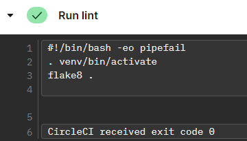
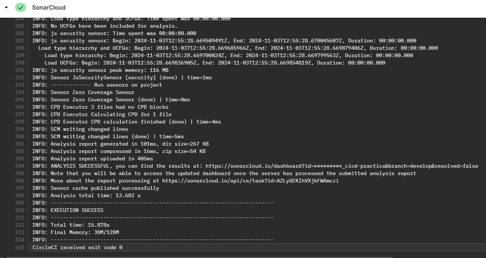

# Practica: CI/CD de una aplicación

## Menú
- [Descripción de la práctica](#descripción-de-la-práctica)
- [Estructura del proyecto](#estructura-del-proyecto)
- [Requisitos](#requisitos)
- [Descripción de los entregables](#descripción-de-los-entregables)
  - [Repositorio en GitHub y gestión de ramas con git flow](#repositorio-en-github-y-gestión-de-ramas-con-git-flow)
  - [Fichero de configuración CI/CD](#fichero-de-configuración-cicd)
    - [Test de la aplicación](#test-de-la-aplicación)
    - [Informe de cobertura](#informe-de-cobertura)
    - [Linting](#linting)
    - [Análisis estático de código](#análisis-estático-de-código)
    - [Análisis de vulnerabilidades](#análisis-de-vulnerabilidades)
  - [Generación de artefactos](#generación-de-artefactos)
  - [Publicación de artefactos en un repositorio](#publicación-de-artefactos-en-un-repositorio)
  - [Construcción de la aplicación](#construcción-de-la-aplicación)

## Descripción de la práctica

Para la práctica se debe implementar un pipeline de CI/CD para una aplicación escrita en el lenguaje de programación que se desee. La aplicación debe ser una aplicación que se pueda ejecutar en un contenedor de Docker. Se tiene que utilizar un servicio de CI/CD que se haya dado en la asignatura (CircleCI, Jenkins o Argo Workflows) aunque se pueden usar otros (Github Actions, Travis CI, etc). La aplicación debe:

1. Estar en un repositorio de GitHub.
2. Utilizar un sistema de gestión de dependencias.
3. Utilizar git flow para la gestión de ramas.
4. Tener un pipeline de CI que:
    1. Construya la aplicación.
    2. Ejecute los tests de la aplicación.
    3. Genere un informe de cobertura de los tests.
    4. Ejecute el linting de la aplicación.
    5. Ejecute un análisis estático de código.
    6. Se ejecute un analisis de vulnerabilidades (usando Snyk o GitGuardian).
    7. Genere un artefacto de la aplicación. (solo en la rama master/main)
    8. Publique el artefacto en un repositorio de artefactos. (solo en la rama master/main)
 5. Se despliegue en en un cluster de Kubernetes usando ArgoCD (o similar) en la rama master/main.

## Estructura del proyecto

Este esquema muestra la organización de los archivos y carpetas para el proyecto.

```
CICD-PRACTICA
├── .circleci/                   # Configuración de CircleCI
│   └── config.yml               # Archivo de configuración de CI/CD
├── app/                         # Código de la aplicación
├── charts/                      # Archivos de Helm para Kubernetes
│   └── application.yaml         # Manifest para el despliegue en Kubernetes
├── img/                         # Recursos de imágenes del proyecto
├── tests/                       # Pruebas unitarias
│   └── ...                      # Archivos de pruebas
├── .dockerignore                # Ignorar archivos en la imagen Docker
├── .flake8                      # Configuración de flake8 para linting
├── .gitignore                   # Ignorar archivos en Git
├── .pylintrc                    # Configuración de pylint
├── dev-requirements.txt         # Dependencias para desarrollo
├── Dockerfile                   # Definición de la imagen Docker
├── README.md                    # Documentación del proyecto
├── requirements.txt             # Dependencias de la aplicación
└── sonar-project.properties     # Configuración de SonarCloud
```
## Requisitos

- **Docker**: Para construir y ejecutar la aplicación en un contenedor.
- **CircleCI**: Servicio de CI/CD utilizado para automatizar el pipeline.
- **ArgoCD**: Utilizado para gestionar el despliegue en el clúster de Kubernetes.
- **GitHub**: Repositorio para el código y manejo de ramas con Git Flow.
- **GitGuardian**: Para análisis de vulnerabilidades.

## Descripción de los entregables
### Repositorio en GitHub y gestión de ramas con git flow
Esta configuración esta orientada para ejecutarse en un flujo de trabajo incluyendo las ramas `develop`, `release` y `main`.

En el  workflow se especifica en que rama se debe ejecutar cada tarea mediante filtros.

```
workflows:
  test-deploy:
    jobs:
      - test:
          context: dev
          filters:
            branches:
              only:
                - develop
                - release
                - main
      - create_release:
          context: dev
          requires:
            - test
          filters:
            branches:
              only:
                - release 
      - publish_github:
          context: dev
          requires:
            - test
          filters:
            branches:
              only:
                - main
      - docker_image:
          context: dev
          requires:
            - test
          filters:
            branches:
              only:
                - main
```
### Fichero de configuración CI/CD

Para el desarrollo de esta práctica se ha usado CircleCI en el que se han especificado los diferentes Pipelines:  

#### Test de la aplicación 
 
Se ejecutan en el job `test` usando `pytest` dado que la aplicación esta en `Python`

- **Informe de cobertura**: Para generar y se guardar el informe de cobertura se requiere usar el pip de `coverage` y se ejecuta de la siguiente manera:  
    ```
        # Generar y guardar el archivo de cobertura             
        - run:
            name: Run tests
            command: |
                . venv/bin/activate
                coverage run -m pytest tests
                coverage xml -o coverage.xml
    ```  
    
- **Linting**: Se requiere usar el pip de `flake8` para verificar el codigo y se ejecuta de la siguiente manera:  
    ``` 
        # Ejecutar lint
        - run:
            name: Run lint
            command: |
                . venv/bin/activate
                flake8 . 
    ```  
     
- **análisis estático de código**: Se utiliza `SonarCloud` para el análisis de calidad, el cual se ejecuta de la siguiente manera:
    ```
    orbs:
    sonarcloud: sonarsource/sonarcloud@2.0.0  
    jobs:
        # Analisis del código estático
        - sonarcloud/scan
    ```
    
    
- **Análisis de vulnerabilidades**: Se ha configurado `GitGuardian`.
    ```
        # Escanear vulnerabilidades con gitGuardian
      - run:
          name: Run GitGuardian scan
          command: |
            . venv/bin/activate
            export GITGUARDIAN_API_KEY=$GITGUARDIAN_API_KEY
            ggshield secret scan repo . 
    ```  
    

#### Generar un artefacto de la aplicación. 
El job `publish_github` genera un archivo app.zip. Este archivo se genera solo en la rama main.  
```
      - run:
          name: Generate artifact
          command: |
            mkdir -p artifacts
            zip -r artifacts/app.zip .
      - store_artifacts:
          path: artifacts/app.zip
```  

#### Publicar el artefacto en un repositorio de artefactos. 
Se publica como un asset en el release de GitHub, solo para la rama main.  
```
- run:
          name: Publish to GitHub Packages
          command: |
            # Publicar el artefacto en el release de GitHub
            curl -u $GITHUB_USER:$GITHUB_TOKEN \
            -H "Content-Type: application/zip" \
            --data-binary @artifacts/app.zip \
            "https://uploads.github.com/repos/$GITHUB_USER/cicd-practica/releases/${RELEASE_ID}/assets?name=app-${VERSION_TAG}.zip"
```  


  

#### Construir la aplicación  

La imagen Docker se construye y se etiqueta en el job `docker_image`, se ejecuta en la rama `main`.  

```
      # Construcción de la imagen
      - run:
          name: Build Docker Image
          command: docker build -t myapp:${VERSION_TAG} .
      # Etiquetado y subida a Docker Hub
      - run:
          name: Tag and Push Image
          command: |
            docker tag myapp:${VERSION_TAG} $DOCKERHUB_USERNAME/myapp:${VERSION_TAG}
            docker push $DOCKERHUB_USERNAME/myapp:${VERSION_TAG}
```
  
  

### Despliegue en ArgoCD
Para el despliegue en Kubernetes se usará ArgoCD junto con las Charts de Helm, para ello se crea un manifiesto de `aplicattion.yaml` especificando las configuraciones iniciales. Los manifiestos de Helm estarán en `./charts`.

```
# Manifiesto de Argocd
apiVersion: argoproj.io/v1alpha1
kind: Application
metadata:
  name: myapp
  namespace: argocd
spec:
  project: default
  source:
    repoURL: 'https://github.com/Bryyyan93/cicd-practica.git'
    targetRevision: main
    path: charts
  destination:
    server: 'https://kubernetes.default.svc'
    namespace: myapp-namespace
  syncPolicy:
    automated:
      prune: true
      selfHeal: true
```
Para verificar el correcto despliegue en ArgoCD se debera:  

- Verificar la instalación de ArgoCD en el Clúster: `kubectl get pods -n argocd`.  
    

- Para desplegar la aplicación se ejecutará el siguiente comando: `kubectl apply -f ./charts/application.yaml -n argocd`.  Se deberá pener el siguiente resultado:
    
    
